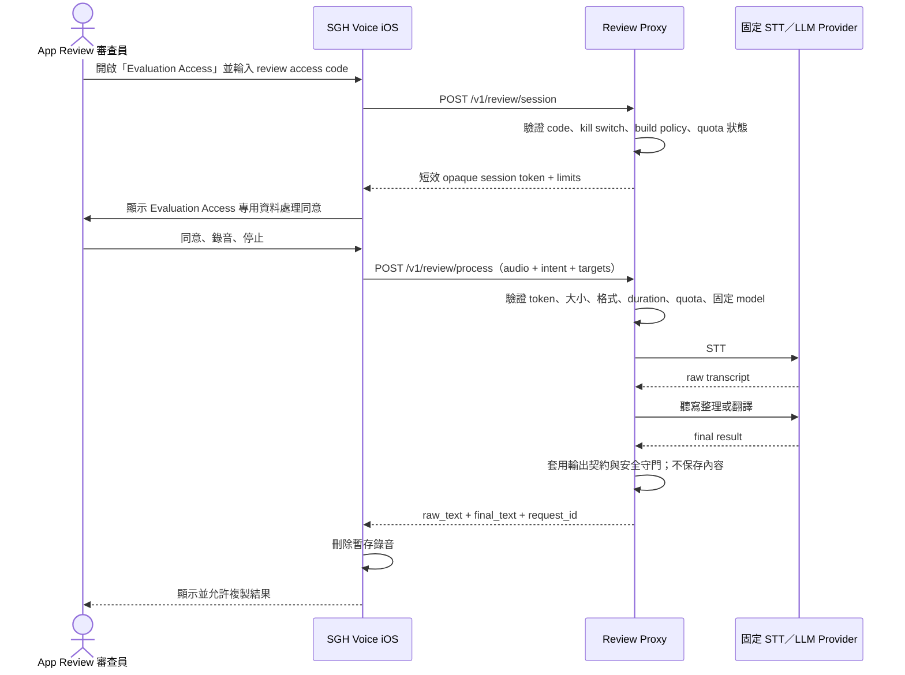

# SGH Voice iOS — App Review Access Architecture

> 狀態：**設計提案，尚未實作**
>
> 查核日期：2026-08-09
>
> 適用範圍：SGH Voice iOS 的 Apple App Review 存取方式
>
> 核心決策：採用 **server-side review proxy**，不得將 OpenAI、Groq 或其他供應商 API key 發給 App，也不得將 proxy 做成 provider token broker。

## 1. 背景與目標

SGH Voice iOS 目前採 BYOK（Bring Your Own Key）：使用者自行輸入 OpenAI、Anthropic 或 Groq API key，App 直接呼叫所選服務。這對正式使用者可降低本公司代管憑證的責任，但 App Review 審查員不應被要求自行申請、購買或準備第三方 API key，否則核心的錄音、轉錄、後處理與翻譯流程可能無法被完整審查。

本設計的目標為：

- 讓 App Review 審查員能測試真實的 `錄音 → STT → LLM 整理／翻譯 → 複製結果` 流程。
- 不在 App binary、原始碼、App Review Notes 或裝置端暴露供應商 API key。
- 不讓 review proxy 成為任意轉送器、公開 AI API 或無上限的成本入口。
- 不接觸正式使用者資料，也不與正式環境共用供應商 project、憑證或資料庫。
- 正式使用者的 BYOK 路徑不依賴 review proxy；review proxy 故障不得破壞 BYOK 功能。
- 向審查員明確揭露 Evaluation Access 的資料流，不使用隱藏 build flag 或僅 Apple 可見的未記載功能。

## 2. 方案比較與推薦

| 方案 | Guideline 2.1 完整性 | Secret 風險 | 實作／營運成本 | 判斷 |
|---|---:|---:|---:|---|
| A. Bundled offline demo | 只有在完整呈現核心功能時才足夠；用 demo mode 取代帳號時 Apple 明文要求 prior approval | 最低 | 真正支援任意語音與翻譯時很高；固定假資料容易被視為非完整功能 | 長期備案，不作第一版唯一審查路徑 |
| B. Server-side review proxy | 可走真實端到端流程；backend 必須在審查期間持續可用 | 供應商 key 留在 server，風險可控 | 中等開發成本與持續營運成本 | **推薦** |
| C. 在 Review Notes 提供供應商 key | 真實功能可測，但憑證必須在審查期間有效 | 極高；供應商明確反對共享或在 mobile client 使用 key | 程式成本最低，事件與費用風險最高 | **不採用** |

推薦方案 B 的「token」只能是本公司核發的短效 review session token；server 不得把第三方 provider token 或 API key 回傳給 App。

## 3. 系統邊界

### 3.1 正式 BYOK 路徑

```text
iOS App ──使用者自己的 API key──> OpenAI / Anthropic / Groq
```

此路徑維持現況。Review proxy 不得讀取、備份或交換使用者輸入的 BYOK key。

### 3.2 Evaluation Access 路徑

```text
App Review 審查員
    │  App Review Notes 內的穩定 review access code
    ▼
SGH Voice iOS
    │  HTTPS + 本公司短效 session token
    ▼
Isolated Review Proxy
    │  server-side provider credential
    ▼
固定且受限的 STT / LLM provider
```

Review proxy 是資料處理代理，不是一般用途 API。它只能接受 SGH Voice 定義的錄音與意圖契約，不能接受任意 upstream URL、任意 model ID、任意 HTTP header 或任意 prompt。

## 4. Client／Server Sequence



若 session 到期，App 可使用相同且仍有效的 review access code 重新取得短效 session。供 Apple 審查使用的 access code 不應在審查期間自動過期，但 server session 必須短效。

## 5. Endpoint Contract

以下為 contract 草案，不含任何真實 hostname、credential 或 secret。

### 5.1 建立 review session

`POST /v1/review/session`

Request：

```json
{
  "access_code": "<APP_REVIEW_NOTES_ONLY>",
  "app_version": "2.7.0",
  "build_number": "8",
  "client_nonce": "<RANDOM_UUID>"
}
```

Response `200`：

```json
{
  "session_token": "<OPAQUE_FIRST_PARTY_SESSION_TOKEN>",
  "expires_in_seconds": 900,
  "limits": {
    "max_audio_bytes": 5242880,
    "max_audio_seconds": 120,
    "max_translation_targets": 4
  },
  "consent_version": 1
}
```

規則：

- `access_code` 只用於取得 session，不得寫入 log、analytics 或 crash report。
- Server 僅保存 access code 的 slow hash；若使用 pepper，pepper 必須在 secrets manager。
- `session_token` 為本公司 token，不是 OpenAI／Groq／Anthropic key。
- Session 建議 15 分鐘到期；穩定 access code 可重新換取。
- `app_version` 與 `build_number` 只能作 policy／觀測依據，不得視為可信安全身分。

### 5.2 處理錄音

`POST /v1/review/process`

Headers：

```text
Authorization: Bearer <FIRST_PARTY_SESSION_TOKEN>
Content-Type: multipart/form-data
```

Multipart fields：

- `audio`：WAV，16 kHz、16-bit、mono，最大 5 MiB、最長 120 秒。
- `metadata`：JSON。

```json
{
  "request_id": "<RANDOM_UUID>",
  "intent": "dictate",
  "translation_targets": [],
  "consent_version": 1
}
```

翻譯範例：

```json
{
  "request_id": "<RANDOM_UUID>",
  "intent": "translate",
  "translation_targets": ["ja", "en"],
  "consent_version": 1
}
```

Response `200`：

```json
{
  "request_id": "<RANDOM_UUID>",
  "raw_text": "辨識後的原始文字",
  "final_text": "整理或翻譯後的文字",
  "intent": "dictate",
  "translation_targets": []
}
```

Server 必須固定 STT／LLM provider 與允許的 model，不接受 client 指定 model、temperature、system prompt、upstream URL 或 Authorization header。

### 5.3 服務狀態

`GET /v1/review/status`

只回傳 `available`、支援的最低／最高 build 與一般化維護訊息，不回傳 provider、credential、quota 使用量或內部錯誤。

### 5.4 錯誤格式

```json
{
  "error": {
    "code": "quota_exceeded",
    "message": "Evaluation Access is temporarily unavailable.",
    "request_id": "<RANDOM_UUID>"
  }
}
```

允許的公開錯誤代碼：

- `invalid_review_access`
- `session_expired`
- `review_access_disabled`
- `quota_exceeded`
- `invalid_audio`
- `unsupported_intent`
- `provider_unavailable`
- `processing_failed`

不得把 provider 原始 error body、內部 URL、stack trace、prompt 或 credential 回傳給 App。

## 6. Authentication 與 Session

- 建立專用、隔離的 review account／credential，不與員工、客戶或正式系統共用。
- Stable review access code 僅放在 App Store Connect 的 App Review Information；不得寫入 repo、binary、公開網站或 screenshots。
- Review access code 在審查與可能複審期間保持有效；需要更換時，先更新 App Review Information，再撤銷舊 code。
- Session token 短效、可撤銷、只允許 review endpoints，不具有管理權限。
- Token 必須具備 server-side audience、environment 與 scope 檢查；不能只靠可偽造的 bundle ID 或 User-Agent。
- 不蒐集 IDFA、序號或其他永久裝置識別碼。Quota 以 credential、session、IP 風險訊號及 server 計數器組合執行。
- App Attest 可列為 Phase 2 強化，但不應成為第一次送審的單點失敗。

## 7. Quota、成本與 Kill Switch

建議初始限制：

- 每個 session 同時最多 2 個 processing request。
- 每個 access code 每日最多 100 次 processing request。
- 每個 IP 每 10 分鐘最多 30 次 session／processing request。
- 每段音訊最大 5 MiB／120 秒。
- 翻譯目標最多 4 種。
- 固定 provider project、固定 STT model、固定 LLM model，不允許高成本 model 切換。
- Provider project 設獨立月度硬上限與 50%、80%、100% 告警。
- Server 提供立即生效的 `REVIEW_ACCESS_ENABLED` kill switch，且可個別撤銷 access code／session。

月度金額、每日 request 數與告警接收人屬使用者決策；送審前必須以真實模型費率和最壞情境重新計算。

Kill switch 啟動後，App 必須顯示 Evaluation Access 暫時不可用及聯絡資訊，不得靜默改用硬編碼 key，也不得自動讀取使用者 BYOK key。若正在 App Review，應先在 App Store Connect 撤回送審或主動通知 Review Team，避免留下不可用 backend。

## 8. Privacy 與 Logging

### 8.1 必須更新的揭露

目前 iOS 同意畫面表示內容不會傳送至新義豊伺服器。Evaluation Access 上線前必須分流顯示，明確說明：

- 音訊與逐字稿會先傳送至新義豊的 review proxy，再由 proxy 傳送至指定 AI provider。
- Evaluation Access 僅供 App Review／受控測試，不等同正式 BYOK 路徑。
- 是否保存內容、provider 保存政策、跨境傳輸、刪除與聯絡方式。
- 禁止輸入可識別患者或其他真實敏感資料；Review Notes 也應要求只使用虛構測試內容。

在送審前同步檢查並更新：

- App 內 Evaluation Access 專用 consent。
- `PrivacyInfo.xcprivacy`。
- App Store Connect 的 App Privacy answers。
- `https://voice.shingihou.com/privacy.html` 正式版本。
- Support／Review Notes 的測試說明。

### 8.2 資料保存

MVP 原則為 content zero-retention：

- Proxy 不持久化 audio、transcript、final result、prompt 或 provider response。
- 不啟用 request／response body capture。
- 暫存物件只能存在於單次 request 記憶體或明確的短效 ephemeral storage，完成或失敗後立即清除。
- Provider retention 依專用 review project 的契約與 data-control 設定另行確認，不能以「proxy 不保存」代表 provider 不保存。

可記錄的 metadata：

- request ID
- 時間
- route
- HTTP／內部分類後的 error code
- latency
- audio byte count 與 duration
- intent 與目標語言數量
- 固定 provider／model ID
- token 使用量與 quota counters
- 不可逆的 credential identifier

禁止記錄：

- Authorization header、access code、session token、provider key
- 原始 IP；若安全需求必須關聯，使用短期 rotating HMAC 或截斷值
- audio、transcript、final text、system/user prompt
- provider 原始 error body

Metadata retention 建議先設 14 天，但最終期限須經使用者／法務決策並寫入正式政策。

## 9. Threat Model

| 威脅 | 可能影響 | 必要控制 |
|---|---|---|
| Review access code 外洩 | 費用濫用、服務阻斷 | 高熵 code、daily quota、IP rate limit、獨立 project、告警、可個別撤銷 |
| Provider key 被竊 | 大額費用、帳戶或資料風險 | Key 只存在 secrets manager／server runtime，永不回傳 App；定期輪替 |
| Proxy 被當成任意 AI relay | 成本與內容濫用 | 固定 schema、固定模型、固定 intent、禁止 client prompt／URL／header |
| Session replay | 配額繞過 | 短效 token、server-side revoke、request ID 去重、並行限制 |
| 超大或畸形 audio | 記憶體／CPU／費用 DoS | Content-Length、magic bytes、WAV 解析、duration、timeout、streaming limit |
| Prompt injection／模型回答問題 | 錯誤輸出或功能越權 | Server 與 client 都保留既有 dictation／translation contracts 與 deterministic guards |
| Reviewer 輸入敏感資料 | 隱私與合規事件 | 專用 consent、Review Notes 使用虛構內容、zero-retention、provider policy 查核 |
| APM／proxy log 收錄內容 | Secret／個資外洩 | 關閉 body capture，集中 redaction tests，metadata allowlist |
| Backend outage | Guideline 2.1 無法測試 | 健康檢查、告警、on-call、送審前與每日 smoke test、Review Notes 聯絡窗口 |
| Review-only 功能被視為隱藏 | Guideline 2.3.1 風險 | UI 可見、Notes 完整揭露、不用 Apple-only build flag、不遠端下載程式碼 |
| Kill switch 誤觸 | 審查流程中斷 | 雙人變更、audit trail、送審期間凍結設定、明確 rollback runbook |

## 10. Repo File Cuts

以下是建議修改點，**目前尚未實作**。

### 10.1 iOS client

- 新增 `ios/SGHVoice/SGHVoice/API/ProcessingBackend.swift`
  - 定義正式 BYOK 與 Evaluation Access 共用的處理介面。
  - 避免在 UI 或 pipeline 散落 mode 判斷。
- 新增 `ios/SGHVoice/SGHVoice/API/ReviewAccessClient.swift`
  - 實作 session 與 `/v1/review/process` contract。
  - 不包含 provider SDK、provider key 或真實 access code。
- 修改 `ios/SGHVoice/SGHVoice/API/ApiConfig.swift`
  - 新增 execution mode、review credential／session 的 Keychain storage。
  - Provider key 與 review credential 使用不同 account／service 名稱。
- 修改 `ios/SGHVoice/SGHVoice/Processing/TranscriptionPipeline.swift`
  - 依注入的 `ProcessingBackend` 執行 BYOK 或 review proxy。
  - Review proxy 錯誤不得 fallback 至另一條資料路徑。
- 修改 `ios/SGHVoice/SGHVoice/UI/SettingsView.swift`
  - 增加可見的「Evaluation Access」登入入口、狀態、登出與資料流說明。
- 修改 `ios/SGHVoice/SGHVoice/UI/MainView.swift`
  - 顯示目前是 BYOK 或 Evaluation Access。
  - Evaluation Access 第一次錄音前顯示專用 consent。
- 修改 `ios/SGHVoice/SGHVoice/UI/MainViewModel.swift`
  - 將 backend 狀態與明確錯誤映射至 UI。
- 修改 `ios/SGHVoice/SGHVoice/PrivacyInfo.xcprivacy`
  - 依實際 server data flow 與 App Store Connect answers 對齊。
- 修改 `ios/SGHVoice/SGHVoiceTests/SGHVoiceTests.swift`
  - 增加 backend routing、auth、quota、redaction、no-fallback 測試。

### 10.2 Privacy／support

- 修改 `sgh-voice-web/privacy.html`，新增 Evaluation Access 專節並部署正式站。
- App Store Connect 填寫 App Review Information、App Privacy 與 Support URL。

### 10.3 Server

目前 repo **沒有可直接使用的 review proxy**。實作前需決定：

- 建立本 repo 的獨立 `review-proxy/` service；或
- 建立另一個專用 private repo／Cloudflare Worker／Vercel service。

不論部署平台，server 必須與正式客戶資料、正式 API key、CRM、患者資料及付款系統完全隔離。

## 11. Test Plan

### 11.1 Client unit tests

- 沒有 BYOK key、有 review session 時，路由到 ReviewAccessClient。
- BYOK mode 不會呼叫 review proxy。
- Review mode 不會讀取或 fallback 到 BYOK key。
- Access code、session token、Authorization 不出現在 error description／log。
- Session expiry 只觸發重新認證，不重送已失敗的 audio。
- Background／cancel／error 時持續刪除 local temp audio。
- Dictation／translation intent、1–4 個 targets 正確序列化。

### 11.2 Server contract／security tests

- 缺少／錯誤 credential、過期 session、kill switch、quota exhaustion。
- WAV magic bytes、MIME、size、duration、empty audio、corrupted audio。
- 拒絕 client model、prompt、upstream URL、provider header 等額外欄位。
- 同一 request ID replay／重複送出。
- Provider timeout、429、4xx、5xx 的安全 error mapping。
- Log snapshot 確認沒有 audio／text／token／provider error body。
- 固定模型與 project budget policy。

### 11.3 Integration／release tests

- Staging：App → proxy → provider 的真實短音訊 smoke test。
- 審查用 credential 從全新安裝登入、重啟、session renewal、登出。
- iPhone 與 iPad、不同語系、Wi-Fi／cellular、slow network。
- TestFlight build 使用與預計送審相同的 endpoint 與 policy。
- 提交前以全新 reviewer 裝置流程逐字執行 Review Notes。
- 送審期間每日 health／quota smoke test；任何失敗立即通知 owner。

## 12. Rollout 與 Rollback

### Phase 0：決策與合規

- 確認接受 Evaluation Access 會經過新義豊 server 的例外資料流。
- 確認 hosting region、provider、retention、budget、owner 與事故窗口。
- 完成 endpoint contract、privacy draft 與 Review Notes draft。

### Phase 1：無 secret client scaffold

- 建立 processing backend protocol、ReviewAccessClient mock、UI 與單元測試。
- 所有測試使用 fixture／mock，不建立或輸入真實 credential。

### Phase 2：隔離 server

- 部署 review proxy staging。
- 設 secrets manager、provider review project、quota、WAF、redaction、alerts。
- 完成 privacy／security review，再建立 production review credential。

### Phase 3：TestFlight 驗證

- 以與 App Review 相同的 Review Notes 執行 fresh-install smoke test。
- 驗證正式 privacy URL 與 App Store Privacy answers。
- 確認 backend on-call 與送審期間變更凍結。

### Phase 4：App Review

- 將穩定 review access code 只放在 App Review Information。
- 保持 backend 與 credential 可用，監控 health、quota 與成本。
- 審查完成後保留低配額 reviewer access，供複審／版本更新；不得無通知立即撤銷。

### Rollback

- Review proxy 故障不影響正式 BYOK path。
- 若在送審前發現問題，關閉 Evaluation Access 並停止提交該 build。
- 若已進入 review，先撤回 submission 或透過 App Review 訊息說明，不讓審查員遇到無法使用的 backend。
- 不以遠端開關偷偷改變 App 的公開核心功能；修復 client 行為需要新 build。

## 13. 需要使用者／外部服務決策

以下項目不能由程式碼自行決定：

1. 是否接受 Evaluation Access 的音訊／文字暫時經過新義豊 server。
2. Server 部署平台、region、repo ownership 與 on-call 人員。
3. Review 專用 provider、模型、合約、DPA／retention 設定及使用授權。
4. 每日 request、每月預算、provider project hard limit 與告警接收人。
5. Metadata retention 最終期限與隱私政策文字。
6. Stable review credential 的建立、保管、輪替、撤銷與 App Review Notes 更新流程。
7. App Store Connect 的 App Privacy answers 與審查聯絡人。
8. 是否另外向 Apple 書面確認此 review access 設計；方案 B 目前沒有公開的 prior-approval 要求，但 Apple 不保證特定實作預先核准。

可在完全沒有 secret 的情況下先實作：client protocol、mock client、UI、endpoint DTO、error mapping、quota／redaction tests、privacy 草案、runbook 與 Review Notes 模板。

必須等待使用者決策／外部服務後才能完成：真實 hostname、server deployment、provider project、provider secret、review access code、budget、App Store Connect metadata 與正式 privacy deployment。

## 14. Apple Review Notes 摘要模板

以下內容可放入 App Store Connect 的 Notes；送審時再補入實際 access code 與聯絡方式。不得將 provider API key 放入此欄。

```text
SGH Voice is a BYOK voice transcription and translation app. Regular users provide their own supported AI-provider API key.

For App Review, please use the isolated Evaluation Access account below. It exercises the same recording, transcription, cleanup, multi-language translation, and copy-result flows without requiring the reviewer to create a third-party provider account.

Evaluation Access code: <ADD IN APP STORE CONNECT ONLY>

Steps:
1. Launch SGH Voice and open Settings.
2. Select Evaluation Access and enter the code above.
3. Return to the main screen, tap the microphone, accept the microphone and data-processing disclosures, speak a short fictional sentence, then tap Stop.
4. Confirm that the raw transcript and cleaned result are displayed and can be copied.
5. Long-press the microphone button, select one or more translation languages, record a fictional sentence, and confirm the translated output.

Evaluation Access sends test audio and transcript text through Shingihou's isolated review proxy to the disclosed AI provider. The app and privacy policy explain this before upload. Please do not use real patient or other sensitive personal information.

The review backend is live and monitored throughout review. If access fails, please contact: <REVIEW CONTACT EMAIL / PHONE>
```

## 15. Apple prior approval 判斷

- **方案 A**：若因法律或安全義務不能提供 demo account／必要資源，而以 built-in demo mode 取代，Apple Guideline 2.1(a) 明文要求 prior approval，且 demo 必須完整呈現功能。
- **方案 B**：Apple 公開規則沒有對 review-only backend 或本公司 session credential 設定專門 prior approval；但必須完整揭露、保持 backend 可用並符合 2.1、2.3.1、5.1.2 與第三方條款。
- **方案 C**：Apple 公開規則沒有對 dedicated provider key 設定專門 prior approval；然而 Apple 要求第三方服務使用必須獲得授權，且 provider 自己的安全規則反對共享／在 mobile client 暴露 key，因此不採用。

## 16. 官方來源

- Apple — [App Review Guidelines](https://developer.apple.com/app-store/review/guidelines/)
  - 2.1：提供完整 review access、backend 必須可用；以 built-in demo mode 取代 demo account 時的 prior approval。
  - 2.3.1：不得包含隱藏、休眠或未記載功能，新增功能必須在 Notes 說明並可供審查。
  - 5.1.2(i)：向第三方 AI 分享個人資料前，須清楚揭露並取得明示同意。
  - 5.2.2：使用第三方服務須符合其條款，Apple 要求時須提供授權。
- Apple — [Platform version information / App Review Information](https://developer.apple.com/help/app-store-connect/reference/app-information/platform-version-information)
  - Notes 可填測試設定與帳號資訊，內容不對顧客公開，上限 4000 bytes；App 登入用 demo account 不得過期。
- Apple — [App Review](https://developer.apple.com/app-store/review/)
  - 特殊設定、帳號資訊與操作說明應填入 App Review Information。
- OpenAI — [Best Practices for API Key Safety](https://help.openai.com/en/articles/5112595-best-practices-for-api-key-safety)
  - API key 不應共享，也不應部署於 mobile client；正式應經由保管 key 的 backend。
- Groq — [Security Onboarding](https://console.groq.com/docs/production-readiness/security-onboarding)
  - 不應將 key 寫入 frontend／client bundle；client-side 使用應透過可信 backend proxy。
- Groq — [Policies & Notices](https://console.groq.com/docs/legal/archive)
  - 第三方服務使用仍須確認目前有效合約對 API key／API access 轉授權與分發的限制。

## 17. 完成定義

只有在以下項目全部有證據時，才能將 Evaluation Access 標記為完成：

- Client 與 server 實作、單元／contract／integration／security tests 通過。
- Provider key 從未出現在 App binary、repo、Review Notes 或 client log。
- Review proxy 已隔離部署，quota、budget、kill switch、alerts、on-call 已驗證。
- 專用 consent、正式 privacy URL 與 App Store Privacy answers 完全一致。
- 審查用穩定 credential 與短效 session renewal 已以 fresh install 驗證。
- TestFlight 上可逐字完成 Review Notes 的錄音、聽寫、翻譯與複製流程。
- Backend 在整個審查與可能複審期間保持可用。
